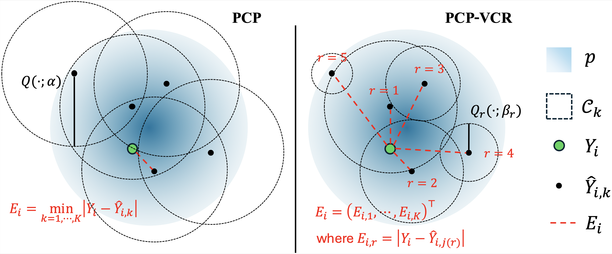
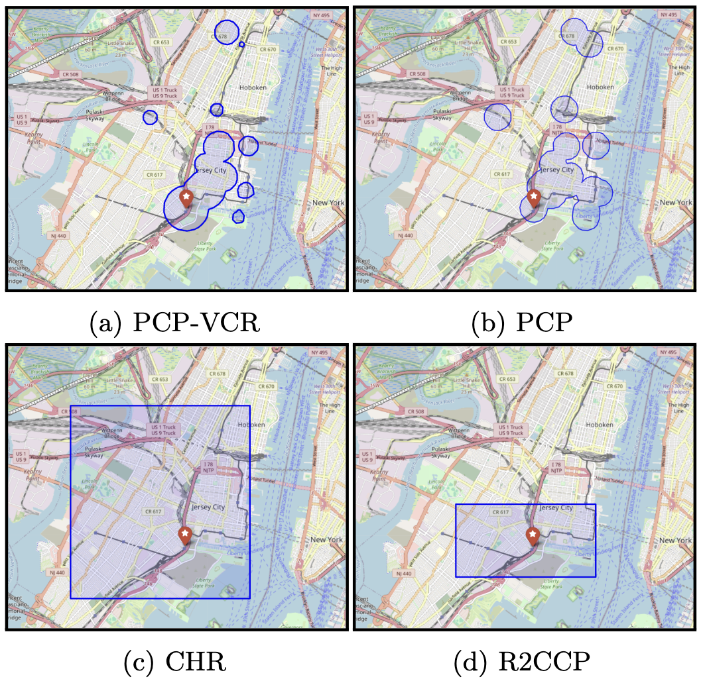

# PCP-VCR: Probabilistic Conformal Prediction with Vectorized Non-Conformity Scores

This repository contains the implementation for the [paper](https://arxiv.org/pdf/2410.13735) **"Optimizing Conformal Prediction with Vectorized Non-Conformity Scores"**. 



## 📖 Overview

Generative models have shown significant promise in critical domains such as medical diagnosis, autonomous driving, and climate science, where reliable decision-making hinges on accurate uncertainty quantification. While probabilistic conformal prediction (PCP) offers a powerful framework for this purpose, its coverage efficiency -- the size of the uncertainty set -- is limited when dealing with complex underlying distributions and a finite number of generated samples. In this paper, we propose a novel PCP framework that enhances efficiency by first vectorizing the non-conformity scores with ranked samples and then optimizing the shape of the prediction set by varying the quantiles for samples at the same rank. Our method delivers valid coverage while producing discontinuous and more efficient prediction sets, making it particularly suited for high-stakes applications. We demonstrate the effectiveness of our approach through experiments on both synthetic and real-world datasets.

### **Key Contributions**:

- **PCP-VCR:** We present a novel method that utilizes vectorized non-conformity scores with ranked samples to enhance the efficiency of probabilistic conformal prediction.
- **Optimized Quantile Adjustment:** We develop an optimization framework that individually adjusts quantile levels for each rank, leading to tighter and more informative uncertainty sets.
- **Efficient Computation:** We propose an efficient heuristic algorithm to approximate the optimal quantile vector, making the method computationally practical for large datasets.
- **Theoretical and Empirical Validation:** We demonstrate through theoretical analysis and empirical evaluations that PCP-VCR maintains valid coverage while significantly improving prediction set efficiency compared to baseline methods.



## 🔍 References

```
@misc{pcp_vcr:2024,
      title={Optimizing Probabilistic Conformal Prediction with Vectorized Non-Conformity Scores}, 
      author={Minxing Zheng and Shixiang Zhu},
      year={2024},
      eprint={2410.13735},
      archivePrefix={arXiv},
      primaryClass={cs.LG},
      url={https://arxiv.org/abs/2410.13735}, 
}
```

